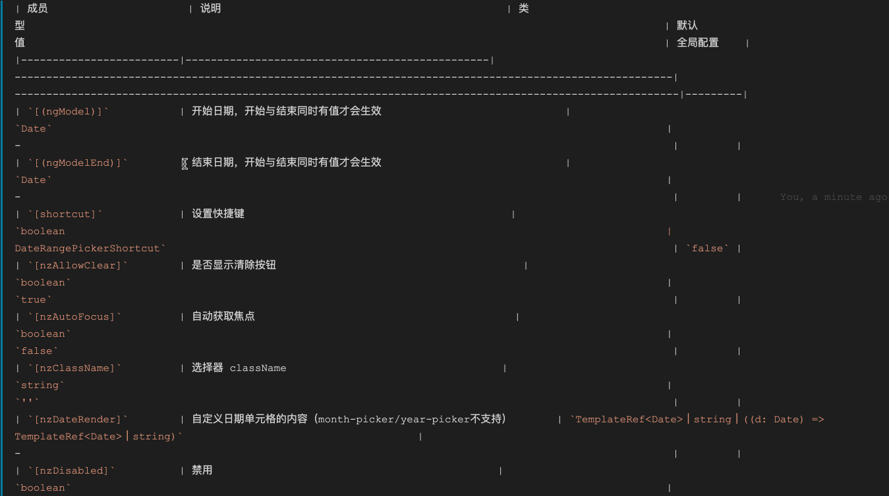

## vscode-markdown-compact-table-formatter

Format Markdown tables in a compact way / 以紧凑的方式格式化 Markdown 表格

## Usage

Uses VSCode `Format Document` and `Format Selection`

### Settings & Keybindings

- **enable**: Enable or disable the formatter;
- **spacePadding**: How many spaces between left and right of each column content;
- **keepFirstAndLastPipes**: Keep first and last pipes "|" in table formatting. Tables are easier to format when pipes are kept;
- **emptyPlaceholder**: The default data when the cell is empty, default: `-`.

## License

See: [LICENSE.md](https://github.com/cipchk/vscode-markdown-compact-table-formatter/blob/master/LICENSE)
